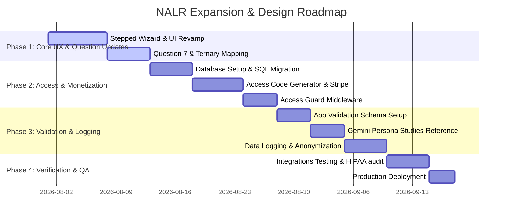

# NALR Product & Design Roadmap

This document outlines the visual design, user experience (UX) strategy, interface design principles, and core implementation timeline for the next version of the Neuro-Adaptive ASD Recommender (NALR) platform.

---

## 1. Core Design Goals & Principles

A screening tool for early toddler autism traits must prioritize **empathy, clarity, and accessibility**. Caregivers using the app may be under emotional stress, so the interface must feel supportive and authoritative, not overwhelming or clinical.

*   **Calming Aesthetics**: Use soft, natural colors (mutes of teal, green, and blue) to foster a calming digital environment. Avoid hyper-stimulating colors or high-contrast warning indicators unless critical.
*   **Cognitive Simplicity**: Keep cognitive load to a minimum. Use progressive disclosure so users are only shown what they need at any given moment.
*   **Mobile-First Accessibility**: Most caregivers access these screeners on mobile phones while tending to children. Large tap targets, clear spacing, and fully responsive layouts are mandatory.
*   **Accessible Typography**: Utilize highly legible, modern fonts (e.g., *Outfit* for headers, *Inter* or *DM Sans* for body copy) that scale across all devices.

---

## 2. Visual Design System (Color Tokens)

The following color tokens are designated for the light and dark themes of the new UI:

| Token Name | Light Mode | Dark Mode | Usage |
| :--- | :--- | :--- | :--- |
| **Primary (Teal)** | `#0d7a6e` (Deep Teal) | `#5ecfc5` (Mint Teal) | Primary branding, buttons, headers |
| **Primary Light** | `#e0f4f2` (Soft Mint) | `#1f383a` (Deep Slate Teal) | Accents, background containers, user chat bubbles |
| **Secondary (Sage)**| `#7ca982` (Warm Sage) | `#4d7c58` (Dark Sage) | Clinical validation badges, positive stats |
| **Background** | `#f7f4ee` (Warm Cream) | `#0f1923` (Ink Navy) | Page background |
| **Paper / Card** | `#ffffff` (White) | `#1a2530` (Slate Blue) | Content cards, form containers, dialog boxes |
| **Ink (Text)** | `#1a2530` (Dark Slate) | `#f0f4f8` (Soft Gray) | Primary readable text |
| **Ink Soft** | `#667a8a` (Muted Gray) | `#8fa4b0` (Cool Silver) | Captions, footnotes, subheadings |
| **Alert Risk** | `#d9534f` (Soft Crimson)| `#ff6b6b` (Vibrant Coral) | High probability warning banners |

---

## 3. UI/UX Interaction Layouts

### A. Progressive Questionnaire Flow
Instead of a single, scrolling form with all 10 questions (which causes user fatigue), the interface will adopt a **stepped question wizard** (one question at a time) with a persistent progress tracker:

```
+-----------------------------------------------------------+
|  Question 3 of 10                       [|||||------] 30% |
|                                                           |
|  Does your child point to indicate that they want         |
|  something (e.g., pointing to a toy out of reach)?        |
|                                                           |
|  ( ) Yes, consistently                                    |
|  ( ) Sometimes / Inconsistently                           |
|  ( ) No, rarely or never                                  |
|                                                           |
|  [ <-- Back ]                               [ Next --> ]  |
+-----------------------------------------------------------+
```

### B. Circular SVG Probability Dial
The results screen features a primary SVG dial representing the predicted probability.
*   **Low Risk (< 50%)**: The dial color transitions from Sage to Teal.
*   **High Risk (>= 50%)**: The dial transitions to Coral, accompanied by a warning indicator.

```
          .-------.
        /   54%     \
       |    RISK     |   <-- Animated SVG Circle Gauge
        \  Coral   /
          '-------'
```

---

## 4. Multi-Phase Implementation Roadmap

The development cycles are structured into 4 sequential phases over a **6-week timeline**:



### Phase 1: Core UX & Questionnaire Updates (Weeks 1)
*   **Tasks**:
    *   Transition from the single-page layout to a stepped form wizard in [index.html](file:///wsl.localhost/Ubuntu/home/techyz-admin/sevenwings/02_startups/neuro-adaptive-recommender/fastapi_app/templates/index.html).
    *   Change Question 7 text to `"Says up to 10 recognisable words"`.
    *   Implement "Sometimes" radio option and map it to `1` (or `0.5` if model testing permits) in [core.py](file:///wsl.localhost/Ubuntu/home/techyz-admin/sevenwings/02_startups/neuro-adaptive-recommender/fastapi_app/core.py).

### Phase 2: Access Control & Monetization (Weeks 2-3)
*   **Tasks**:
    *   Configure SQLite/PostgreSQL tables for users and access licenses.
    *   Implement an API endpoint to generate access codes.
    *   Add a route protection middleware block that verifies access codes.
    *   Create a simple payment webhook landing hook to simulate code generation upon purchasing a license.

### Phase 3: Clinical App Validation & Data Logging (Weeks 4-5)
*   **Tasks**:
    *   Extend `app_cache.json` schema to hold scientific validation data and update `/recommend` endpoint algorithms.
    *   Rephrase Gemini Nora's instructions to cross-reference scientific validation details when recommending apps.
    *   Create the `screening_logs` table to save input metrics securely.
    *   Implement data masking and anonymization guards on logs to ensure HIPAA compliance.

### Phase 4: Security Audit & Production Launch (Week 6)
*   **Tasks**:
    *   Run security audits on access code expiration and verify that expired tokens return `403 Forbidden` errors.
    *   Perform performance testing on TF-IDF recommendations.
    *   Validate UI design scaling on iOS and Android viewports.
    *   Deploy backend services onto Vercel and production databases.
