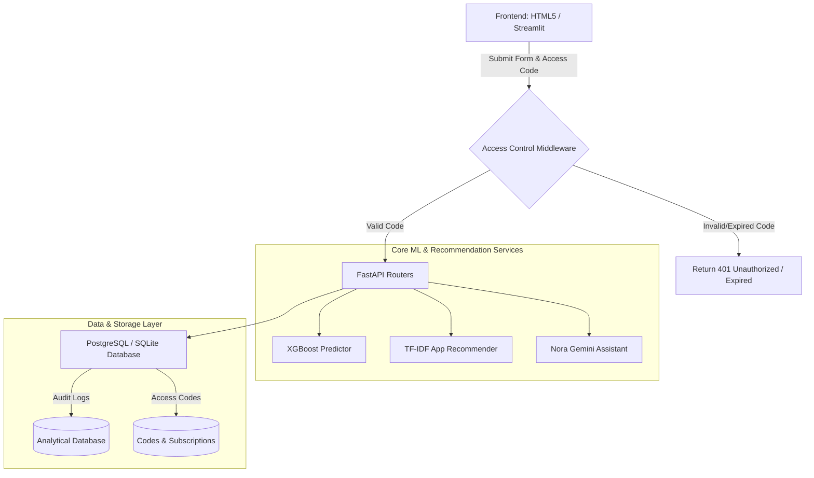

# Technical Specification: NALR Platform Expansion & Enhancements

This document translates the unstructured notes for the Neuro-Adaptive ASD Recommender (NALR) app enhancements into a formalized technical plan. It details the required features, UI changes, backend modifications, database requirements, and validation strategies.

***

## 1. Document Control

* **Title**: Technical Specification: NALR Platform Expansion & Enhancements

* **Status**: Proposed / Under Review

* **Target Version**: v3.0.0

* **Last Updated**: July 31, 2026

***

## 2. Feature Specifications & Technical Design



***

## 3. Scope of Adjustments

### 1. Expanded Age Indicator (18 to 48 Months)

* **Objective**: Broaden the target age range of toddlers screened by the system from the original `12–36 months` window to `18–48 months`.

* **Required Modifications**:

  * **Frontend Verification**:

    * Update the HTML range slider/number inputs in `index.html` to set `min="18"` and `max="48"`.

    * Update helper prompts and descriptions mentioning "12 to 36 months" to "18 to 48 months".

  * **Backend Schema Validation**:

    * Modify `fastapi_app/schemas.py#ScreeningContext` to accept ages between 18 and 48 in validation constraints (if any).

  * **Model Review**:

    * *Note*: The underlying XGBoost model is trained on a toddler dataset. Extending the age limit to 48 months (4 years) may affect model precision if the training dataset was heavily constrained to younger toddlers. A verification step should be planned to run evaluations on samples for kids aged 36–48 months.

### 2. Scientific Validation of Recommended Apps

* **Objective**: Ensure that apps recommended to caregivers are clinically backed, scientifically proven, or peer-reviewed.

* **Proposed Approach**:

  1. **Schema Enrichment**: Update the app database structure in `app_cache.json` to store scientific validation details:

     ```json
     {
       "App_Name": "Language Therapy for Children (MITA)",
       "Category": "Education",
       "Rating": 4.64,
       "Price": "Free",
       "clinical_studies": [
         "3-year clinical trial of 6,454 children published in Journal Healthcare (2020)."
       ],
       "clinically_validated": true
     }
     ```
  2. **TF-IDF Filter Integration**: Update the recommendation function in `core.py#recommend_apps` to prioritize or exclusively select apps where `clinically_validated == true`.
  3. **Generative AI Persona Alignment**: Adjust the system prompt for the Gemini agent (Nora) in `core.py#CHAT_SYSTEM_PROMPT` to reference validation records:

     * *Instruction*: "Nora must explicitly mention the scientific studies or validation status of an app when explaining its benefits to the parent, using the `clinical_studies` metadata."

### 3. Questionnaire Text Modification (Question 7)

* **Objective**: Clarify Q-CHAT-10 Question 7 to measure expressive language milestones more precisely.

* **Current Text**: `"Uses basic words or speech"` / `"Responds using words"`

* **New Text**: `"Says up to 10 recognisable words"`

* **Required Modifications**:

  * **Jinja UI**: Modify index.html labels for Question 7.

  * **Labels Mapping**: Update the key label dictionary in core.py:

    ```python
    QUESTION_LABELS = {
        # ...
        "A7": "Says up to 10 recognisable words",
        # ...
    }
    ```

### 4. Three-State Question Answering ("Sometimes")

* **Objective**: Allow caregivers to reply with **"Sometimes"** instead of forcing a binary **"Yes"** or **"No"** response.

* **Technical Design Options**:
  Since the underlying machine learning model expects binary inputs (0 or 1), a mapping strategy must be defined:

| Option                                | Mapping Strategy                                           | Pros                                                                                                   | Cons                                                                                                                                                |
| :------------------------------------ | :--------------------------------------------------------- | :----------------------------------------------------------------------------------------------------- | :-------------------------------------------------------------------------------------------------------------------------------------------------- |
| **Option A (Heuristic/Conservative)** | Map "Sometimes" to `1` (Flagged/Delayed milestone)         | Err on the side of caution; ensures parents seek evaluation if a milestone is only inconsistently met. | May slightly increase false-positive risk scores.                                                                                                   |
| **Option B (Threshold-Based)**        | Map "Sometimes" to `0.5`                                   | Represents intermediate progress.                                                                      | Standard XGBoost models trained on boolean flags might struggle or output unpredictable probabilities when fed a value of `0.5` without retraining. |
| **Option C (Retrain Model)**          | Recode training data and retrain model with ternary states | Scientifically sound.                                                                                  | Requires retraining, validation, and deployment of a new model version.                                                                             |

* **Recommendation**: Implement **Option A** for the initial rollout as a safety-first clinical approach (if a milestone is only met "sometimes", it represents a potential delay that warrants attention), while collecting "Sometimes" responses in the database to enable future model retraining (**Option C**).

* **UI Changes**: Replace the binary toggle buttons or checkboxes in `index.html` with a three-option radio button selection (`Yes` [0], `Sometimes` [Mapped to 1/0.5], `No` \[1]).

### 5. Monitored Access & Token-Based Monetization

* **Objective**: Limit application usage to authenticated users who possess a valid, time-limited, or payment-linked access code.

#### Access Token Lifecycles & Verification Flow

```
Caregiver Pays fee ──> System Generates Code ──> User Logs In ──> Middleware Validates ──> Session Expires
(Stripe / Stripe Webhook)     (30-day token)      (Token Cached)       (Checks DB / JWT)        (Code Deactivated)
```

#### Proposed Database Tables

We will transition NALR to a relational SQLite/PostgreSQL storage structure:

```sql
CREATE TABLE users (
    id SERIAL PRIMARY KEY,
    email VARCHAR(255) UNIQUE NOT NULL,
    role VARCHAR(50) DEFAULT 'caregiver', -- caregiver, clinician, admin
    created_at TIMESTAMP DEFAULT CURRENT_TIMESTAMP
);

CREATE TABLE access_codes (
    id SERIAL PRIMARY KEY,
    user_id INT REFERENCES users(id),
    code_hash VARCHAR(64) UNIQUE NOT NULL,
    amount_paid DECIMAL(10, 2) NOT NULL,
    starts_at TIMESTAMP NOT NULL,
    expires_at TIMESTAMP NOT NULL,
    is_active BOOLEAN DEFAULT TRUE,
    created_at TIMESTAMP DEFAULT CURRENT_TIMESTAMP
);
```

#### Middleware Guard

Create a FastAPI middleware validator that checks the authorization header or browser cookie:

```python
# fastapi_app/middleware.py
from fastapi import Request, HTTPException
from datetime import datetime

async def verify_access_code(request: Request):
    # Bypass for static files, landing page, and health checks
    if request.url.path in ["/", "/health", "/favicon.ico"] or request.url.path.startswith("/static"):
        return
        
    auth_code = request.cookies.get("nalr_access_code") or request.headers.get("X-Access-Code")
    if not auth_code:
        raise HTTPException(status_code=401, detail="Access code is required.")
        
    code_record = await db.get_active_code(auth_code)
    if not code_record or code_record.expires_at < datetime.utcnow():
        raise HTTPException(status_code=403, detail="Your access code has expired or is invalid.")
```

### 6. Longitudinal Caregiver-Toddler Data Tracker

* **Objective**: Log all user inputs, screening metrics, and recommendations securely to enable clinical analysis, longitudinal research, and model refinement.

#### Proposed Analytics Table

```sql
CREATE TABLE screening_logs (
    id SERIAL PRIMARY KEY,
    user_id INT REFERENCES users(id),
    age_months INT NOT NULL,
    sex_label VARCHAR(10) NOT NULL,
    A1 INT NOT NULL, -- Answers (0 = Yes, 1 = No, 2 = Sometimes)
    A2 INT NOT NULL,
    A3 INT NOT NULL,
    A4 INT NOT NULL,
    A5 INT NOT NULL,
    A6 INT NOT NULL,
    A7 INT NOT NULL,
    A8 INT NOT NULL,
    A9 INT NOT NULL,
    A10 INT NOT NULL,
    risk_probability DECIMAL(5, 2) NOT NULL,
    total_flags INT NOT NULL,
    recommended_apps TEXT, -- JSON Array of app names
    created_at TIMESTAMP DEFAULT CURRENT_TIMESTAMP
);
```

#### Security & Compliance Considerations

* **HIPAA/GDPR Compliance**:

  * Toddler data must be anonymized or pseudonymized for clinical analytics.

  * Encrypt caregiver emails and PII in transit (HTTPS) and at rest (AES-256).

  * Establish a data retention policy setting how long logs are stored post-expiry.

***

## 4. Required Implementation Modifications

To apply these changes, the following assets must be modified:

| Component          | Target File                                                                                                                                          | Action Required                                                                                                             |
| :----------------- | :--------------------------------------------------------------------------------------------------------------------------------------------------- | :-------------------------------------------------------------------------------------------------------------------------- |
| **Data models**    | [schemas.py](file:///wsl.localhost/Ubuntu/home/techyz-admin/sevenwings/02_startups/neuro-adaptive-recommender/fastapi_app/schemas.py)                | Update schemas for screening inputs to support the "Sometimes" string/integer value and validate ages `18-48`.              |
| **Core Functions** | [core.py](file:///wsl.localhost/Ubuntu/home/techyz-admin/sevenwings/02_startups/neuro-adaptive-recommender/fastapi_app/core.py)                      | Modify prediction mapping (to map "Sometimes" to the model's expected format) and integrate the Gemini validation criteria. |
| **Routing Guard**  | [main.py](file:///wsl.localhost/Ubuntu/home/techyz-admin/sevenwings/02_startups/neuro-adaptive-recommender/fastapi_app/main.py)                      | Introduce SQL/database connection lifespans and register token verification middleware.                                     |
| **Endpoints**      | [routers.py](file:///wsl.localhost/Ubuntu/home/techyz-admin/sevenwings/02_startups/neuro-adaptive-recommender/fastapi_app/routers.py)                | Add `/login` and `/generate-code` routes, and save inputs to the `screening_logs` database.                                 |
| **Form UI**        | [index.html](file:///wsl.localhost/Ubuntu/home/techyz-admin/sevenwings/02_startups/neuro-adaptive-recommender/fastapi_app/templates/index.html)      | Revamp Q-CHAT-10 inputs to include "Sometimes" options, modify Question 7, and update the age limits on input fields.       |
| **App Store**      | [app\_cache.json](file:///wsl.localhost/Ubuntu/home/techyz-admin/sevenwings/02_startups/neuro-adaptive-recommender/fastapi_app/files/app_cache.json) | Add `clinically_validated` boolean and `clinical_studies` text metadata to items.                                           |

